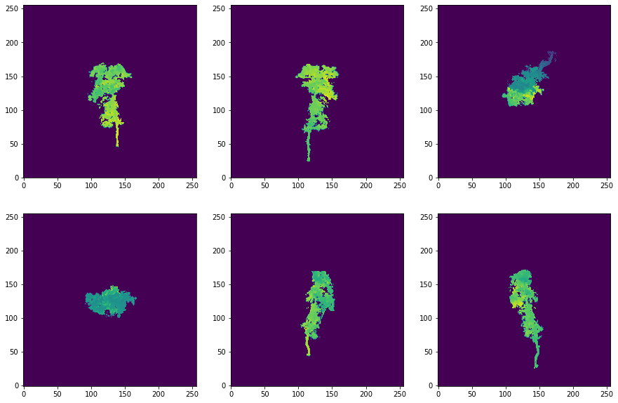

# TreeLS
Implementation for TLS species ID paper - placeholder.

**(IMPORTANT) A note before this readme begins** - the code for this paper was written when the original publication, 
*Revisiting Point Cloud Shape Classification with a Simple and Effective Baseline* (Goyal et al., 2021), was under review and code from the original authors 
was not available. Now that it has been published, you can find it [here](https://github.com/princeton-vl/SimpleView). You might find that it is better 
optimised, or in some way more flexible/easier to use. Otherwise, details for this repository can be found below. <br/>
<br/>
==================================================================================<br/>



[intro]

## Folder Structure

```
|-- LICENSE 
|-- README.md 
|-- TreeLS.yml 
| 
|-- data 
|   |-- treesXYZ 
|       |-- tree_id1.txt --> .txt files with containing point cloud data 
|                             i.e x1 y1 z1
|                                 x2 y2 z2
|       |-- tree_id2.txt      
|       |-- ... 
|
|   |-- meta
|       |-- tree-meta.csv --> metadata file describing species for each sample in treesXYZ
|                             it should have two columns 'id' and 'sp' containing identifiers and species labels
|                             with the id matching the filename for the corresponding pointcloud (w/o file extension)
|
|                             e.g. 
|                             id        sp
|                             tree_id1  QUEFAG
|                             ...
| 
|-- utils 
|   |-- __init__.py 
|   |-- dataset.py 
|   |-- utils.py 
|   |-- train.py 
|   |-- test.py 
| 
|-- sh 
|   |-- dl-simpleview.sh
```

## Demonstration notebook

## Projecting individual samples

## Building PyTorch datasets

## Inference

### Single Sample

### PyTorch datasets
